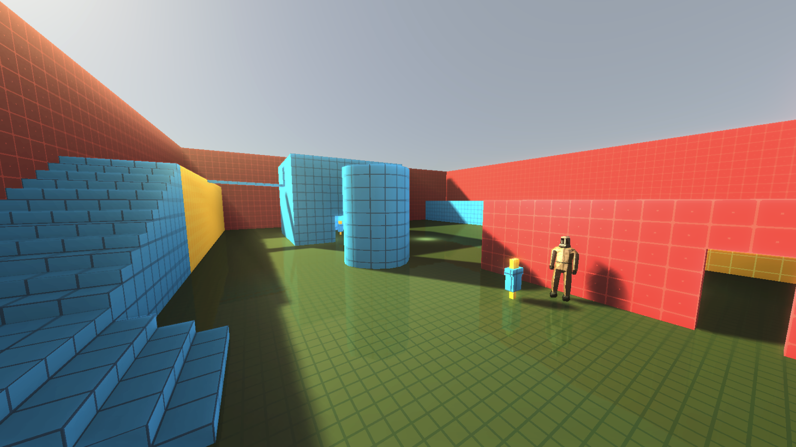

# Nuake

## Id Tech inspired game engine
Nuake is a game engine in developement that focuses on fast level design iteration time that integrates with quake level editing software. 
> It is currently in developement and is not feature complete. We are currently aiming for an alpha release with basic features and a demo level showcasing the current features.

You can join the discord server where I post updates and screenshots or are looking to contribute to the project:

 

## Current Features
- ECS system
- Modern physic engine (Jolt physic) 
- PBR Renderer
- Post processing effects(Bloom, SSAO, SSR, Volumetrics, Procedural Sky)
- Wren Scripting
- Trenchbroom integration

## Planned features
- C# Scripting
- Custom Shaders
- Spatialized audio
- NuakeUI integration
- Dynamic global illumination
- Asset packing
- Terrain editor
- WAD converter

## Contributing
We are currently looking for contributors, feel free to join the discord if you are looking to help the project.

## Compiling the engine
1. Clone the repos using `git clone --recurse-submodules https://github.com/antopilo/Nuake.git`
2. Run the `generate.bat` to generate the sln files.
3. Open `Nuake.sln`
4. Build and run

# Documentation and demos
> The current documentation is not up to date
You can access the current documentation at [here](https://nuake.readthedocs.io/en/latest/index.html)

